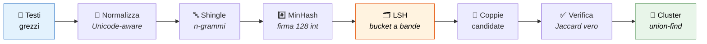

<div align="center">

# 👥 Sosia

**Trova i "sosia" nei tuoi dati: fuzzy matching e deduplica di record — in ogni lingua, senza dipendenze**


*Trova clienti duplicati, prodotti ripetuti e anagrafiche sporche<br>
in dataset enormi — senza confrontare tutto con tutto.*

</div>

---

```
Mario Rossi, Via Garibaldi 12, Milano
MARIO ROSSI  via garibaldi 12  MILANO      ← stesso cliente
Mario Rosi - V. Garibaldi 12 - Milano      ← refuso, stesso cliente
田中太郎 東京都渋谷区神南1-19-11
田中 太郎 東京都渋谷区神南１－１９－１１      ← stesso cliente (larghezza piena)
```

## 📑 Indice

- [Avvio rapido](#-avvio-rapido)
- [Come funziona](#-come-funziona)
- [Funziona in ogni lingua](#-funziona-in-ogni-lingua)
- [Uso come libreria](#-uso-come-libreria)
- [Gli algoritmi, spiegati](#-gli-algoritmi-spiegati)
- [Benchmark](#-benchmark)
- [Test](#-test)
- [Struttura del progetto](#-struttura-del-progetto)

## ⚡ Avvio rapido

Nessuna installazione, nessuna dipendenza — solo Python 3.9+:

```bash
git clone https://github.com/TUO-USERNAME/sosia.git
cd sosia
python -m sosia esempi/clienti.csv --column nome,indirizzo,citta --threshold 0.6
```

Output:

```
10 record, 3 gruppi di duplicati, 4 record ridondanti (soglia 0.6)

--- gruppo 1 (3 record) ---
  riga 2: Mario Rossi Via Garibaldi 12 Milano
  riga 4: MARIO ROSSI via garibaldi 12 MILANO
  riga 6: Mario Rosi V. Garibaldi 12 Milano

--- gruppo 2 (2 record) ---
  riga 3: Giulia Bianchi Corso Italia 5 Torino
  riga 7: giulia bianchi corso italia 5 torino
...
```

Prova anche il dataset multilingua:

```bash
python -m sosia esempi/clienti_mondo.csv --column nome,indirizzo --threshold 0.6
```

## 🧠 Come funziona

Confrontare ogni coppia di record costa **O(n²)**: su 1 milione di record sono
**500 miliardi di confronti**. Questa libreria usa la pipeline dei sistemi
reali (motori di ricerca, data warehouse) per arrivare a un costo quasi lineare:



Il passaggio chiave è l'**LSH** (arancione): riduce le coppie da controllare
da miliardi a poche migliaia, *senza perdere i duplicati veri*.

## 🌍 Funziona in ogni lingua

La parte delicata del multilingua: **la stessa operazione è giusta in una
lingua e sbagliata in un'altra**. La normalizzazione conosce le regole di
ogni scrittura:

| Lingua | Regola applicata | Esempio |
|--------|------------------|---------|
| 🇯🇵 giapponese | larghezza piena → normale (NFKC) | `Ｔｏｋｙｏ` = `Tokyo` |
| 🇯🇵 giapponese | dakuten **preservato** (semantico) | `か` ≠ `が` |
| 🇨🇳 cinese/CJK | spazi tra ideogrammi rimossi | `北京市 朝阳区` = `北京市朝阳区` |
| 🇸🇦 arabo | harakat rimossi, alef unificate | `مُحَمَّد` = `محمد` |
| 🇮🇱 ebraico | niqqud rimosso | `שָׁלוֹם` = `שלום` |
| 🇮🇳 hindi | matra (vocali) **preservate** | `कि` ≠ `क` |
| 🇩🇪 tedesco | casefold, non solo lowercase | `STRASSE` = `straße` |
| 🇷🇺 russo | accenti tonici e maiuscole via | `МОСКВА́` = `москва` |

Anche la lunghezza degli shingle si adatta: **k=2** per
cinese/giapponese/coreano (un carattere ≈ una sillaba), **k=3** altrove.

## 📚 Uso come libreria

```python
from sosia import cluster_duplicates, find_duplicates, levenshtein_ratio

testi = [
    "Mario Rossi, Milano",
    "mario rossi milano",
    "Giulia Bianchi, Torino",
]

cluster_duplicates(testi, threshold=0.6)   # → [[0, 1]]
find_duplicates(testi, threshold=0.6)      # → [(0, 1, 1.0)]
levenshtein_ratio("Rossi", "Rosi")         # → 0.8
```

| Parametro   | Default | Effetto |
|-------------|---------|---------|
| `threshold` | `0.7`   | soglia Jaccard minima; abbassala per match più permissivi |
| `k`         | auto    | lunghezza shingle: automatica per script (2 CJK, 3 altrove) |
| `num_perm`  | `128`   | precisione della stima MinHash (errore ~1/√num_perm) |
| `bands`     | `32`    | più bande = soglia LSH più bassa (più candidati) |

## 🔬 Gli algoritmi, spiegati

Clicca per espandere ogni passaggio della pipeline. 👇

<details>
<summary><b>1️⃣ Normalizzazione</b> — <code>sosia/similarity.py</code></summary>

<br>

Prima di confrontare, si puliscono i testi in modo consapevole dello script
Unicode:

1. **NFKC** — normalizzazione di compatibilità: larghezza piena → normale,
   legature sciolte
2. **casefold** — minuscole robuste (`ß` → `ss`, non solo `lower()`)
3. **Diacritici**: rimossi solo dove sono decorativi (latino, greco,
   cirillico) o opzionali (harakat arabi, niqqud ebraici); **preservati**
   dove cambiano la parola (vocali hindi, dakuten giapponese)
4. **Punteggiatura → spazio**, spazi compattati, spazi tra ideogrammi CJK
   rimossi

```python
normalize("Müller, JÖRG ")   # → "muller jorg"
normalize("Ｔｏｋｙｏ")        # → "tokyo"
normalize("مُحَمَّد")            # → "محمد"
```

</details>

<details>
<summary><b>2️⃣ Shingle + Jaccard</b> — la stringa diventa un insieme</summary>

<br>

Una stringa viene trasformata nell'**insieme dei suoi n-grammi** di caratteri:

```python
shingles("ciao", 3)   # → {"cia", "iao"}
```

Ora due testi si confrontano con la **similarità di Jaccard**:

$$J(A, B) = \frac{|A \cap B|}{|A \cup B|}$$

1.0 = identici, 0.0 = nessun n-gramma in comune. I refusi cambiano pochi
n-grammi, quindi i quasi-duplicati mantengono Jaccard alto.

</details>

<details>
<summary><b>3️⃣ MinHash</b> — comprimere un insieme in 128 numeri</summary>

<br>

Problema: gli insiemi di shingle sono grandi. MinHash li comprime in una
**firma di 128 interi** con una proprietà magica:

> Se applichi una funzione hash a tutti gli elementi di due insiemi e tieni
> solo il **minimo**, la probabilità che i due minimi coincidano è
> **esattamente la similarità di Jaccard**.

Ripetendo con 128 funzioni hash indipendenti (famiglia universale
`h(x) = (a·x + b) mod P` con P primo di Mersenne 2⁶¹−1):

```python
h = MinHasher(num_perm=128)
sig = h.signature(shingles("il gatto sul tetto"))   # tupla di 128 interi
```

La frazione di posizioni uguali tra due firme **stima Jaccard** con errore
~1/√128 ≈ 9%. Un documento di 10.000 shingle diventa 128 numeri.

</details>

<details>
<summary><b>4️⃣ LSH a bande</b> — l'ingrediente che evita O(n²)</summary>

<br>

La firma viene spezzata in **32 bande da 4 valori**. Due record diventano
**candidati** se almeno una banda coincide esattamente (stesso bucket di una
hash table).

Per una coppia con similarità *s*:

$$P(\text{candidato}) = 1 - (1 - s^{4})^{32}$$

È una **curva a S**: quasi 0 sotto la soglia (~0.42), quasi 1 sopra.
Le coppie simili collidono quasi sempre, quelle diverse quasi mai — e
confrontiamo solo chi collide.

| similarità s | P(diventa candidato) |
|:---:|:---:|
| 0.2 | 5% |
| 0.4 | 57% |
| 0.6 | 99.3% |
| 0.8 | ~100% |

</details>

<details>
<summary><b>5️⃣ Verifica + clustering</b> — union-find</summary>

<br>

Le coppie candidate vengono verificate con il **Jaccard vero** (elimina i
falsi positivi dell'LSH), poi raggruppate con **union-find** con path
compression:

> Se A~B e B~C, allora {A, B, C} finiscono nello stesso cluster anche se
> A e C non superano la soglia direttamente (chiusura transitiva).

```python
cluster_duplicates(testi, threshold=0.6)
# → [[0, 1, 2], [3, 4]]   (cluster più grande prima)
```

</details>

<details>
<summary><b>➕ Bonus: Levenshtein</b> — per il confronto fine</summary>

<br>

Inclusa anche la classica **distanza di edit** (programmazione dinamica,
O(n·m) tempo ma solo due righe di memoria), utile come giudice finale su
coppie già candidate:

```python
levenshtein("kitten", "sitting")    # → 3
levenshtein_ratio("Rossi", "Rosi")  # → 0.8
```

</details>

## 📊 Benchmark

5.500 record sintetici (anagrafica con 10% di duplicati con refusi):

| Metodo | Coppie confrontate | |
|--------|-------------------:|---|
| Forza bruta | 15.122.250 | 🐌 |
| **LSH** | **209.559** | ⚡ **72× in meno** |

E il divario **cresce quadraticamente** col dataset: a 1 milione di record
la forza bruta è fuori scala, l'LSH resta quasi lineare.

## ✅ Test

```bash
python -m unittest discover tests
```

38 test: casi noti di Levenshtein, proprietà di MinHash (determinismo,
accuratezza della stima), comportamento dell'LSH, pipeline end-to-end e
normalizzazione multilingua (🇯🇵 🇨🇳 🇸🇦 🇮🇱 🇮🇳 🇷🇺 🇬🇷 🇩🇪 🇰🇷).

## 📁 Struttura del progetto

```
sosia/
├── similarity.py    normalizzazione Unicode-aware, Levenshtein, shingle, Jaccard
├── minhash.py       firme MinHash (hash universale + FNV-1a)
├── lsh.py           indice LSH a bande
├── dedupe.py        pipeline completa + clustering union-find
└── __main__.py      CLI per file CSV
tests/               38 test unittest
esempi/              CSV dimostrativi (italiano + multilingua)
```

## 📄 Licenza

[MIT](LICENSE) — usalo come vuoi.

---

<div align="center">
<i>Costruito da zero per capire davvero come funzionano MinHash e LSH 🚀</i>
</div>
