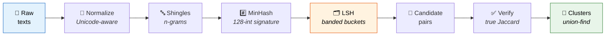

<div align="center">


<br>


*Find duplicate customers, repeated products and dirty master data<br>
in huge datasets — without comparing everything against everything.*

</div>

---

```
Mario Rossi, Via Garibaldi 12, Milano
MARIO ROSSI  via garibaldi 12  MILANO      ← same customer
Mario Rosi - V. Garibaldi 12 - Milano      ← typo, same customer
田中太郎 東京都渋谷区神南1-19-11
田中 太郎 東京都渋谷区神南１－１９－１１      ← same customer (full-width)
```

## 📑 Table of contents

- [Quick start](#-quick-start)
- [How it works](#-how-it-works)
- [Works in every language](#-works-in-every-language)
- [Library usage](#-library-usage)
- [The algorithms, explained](#-the-algorithms-explained)
- [Benchmark](#-benchmark)
- [Tests](#-tests)
- [Project structure](#-project-structure)

## ⚡ Quick start

No installation, no dependencies — just Python 3.9+:

```bash
git clone https://github.com/gerefloc45/sosia.git
cd sosia
python -m sosia esempi/clienti.csv --column nome,indirizzo,citta --threshold 0.6
```

Output:

```
10 record, 3 gruppi di duplicati, 4 record ridondanti (soglia 0.6)

--- gruppo 1 (3 record) ---
  riga 2: Mario Rossi Via Garibaldi 12 Milano
  riga 4: MARIO ROSSI via garibaldi 12 MILANO
  riga 6: Mario Rosi V. Garibaldi 12 Milano

--- gruppo 2 (2 record) ---
  riga 3: Giulia Bianchi Corso Italia 5 Torino
  riga 7: giulia bianchi corso italia 5 torino
...
```

Also try the multilingual dataset:

```bash
python -m sosia esempi/clienti_mondo.csv --column nome,indirizzo --threshold 0.6
```

## 🧠 How it works

Comparing every pair of records costs **O(n²)**: on 1 million records that's
**500 billion comparisons**. This library uses the same pipeline as real-world
systems (search engines, data warehouses) to reach near-linear cost:



The key step is **LSH** (orange): it cuts the pairs to check
from billions down to a few thousand, *without losing the true duplicates*.

## 🌍 Works in every language

The tricky part of multilingual matching: **the same operation is correct in
one language and wrong in another**. Normalization knows the rules of each
script:

| Language | Rule applied | Example |
|----------|--------------|---------|
| 🇯🇵 Japanese | full-width → regular (NFKC) | `Ｔｏｋｙｏ` = `Tokyo` |
| 🇯🇵 Japanese | dakuten **preserved** (semantic) | `か` ≠ `が` |
| 🇨🇳 Chinese/CJK | spaces between ideograms removed | `北京市 朝阳区` = `北京市朝阳区` |
| 🇸🇦 Arabic | harakat removed, alef forms unified | `مُحَمَّد` = `محمد` |
| 🇮🇱 Hebrew | niqqud removed | `שָׁלוֹם` = `שלום` |
| 🇮🇳 Hindi | matras (vowel signs) **preserved** | `कि` ≠ `क` |
| 🇩🇪 German | casefold, not just lowercase | `STRASSE` = `straße` |
| 🇷🇺 Russian | stress marks and uppercase removed | `МОСКВА́` = `москва` |

Shingle length adapts too: **k=2** for Chinese/Japanese/Korean
(one character ≈ one syllable), **k=3** elsewhere.

## 📚 Library usage

```python
from sosia import cluster_duplicates, find_duplicates, levenshtein_ratio

texts = [
    "Mario Rossi, Milano",
    "mario rossi milano",
    "Giulia Bianchi, Torino",
]

cluster_duplicates(texts, threshold=0.6)   # → [[0, 1]]
find_duplicates(texts, threshold=0.6)      # → [(0, 1, 1.0)]
levenshtein_ratio("Rossi", "Rosi")         # → 0.8
```

| Parameter   | Default | Effect |
|-------------|---------|--------|
| `threshold` | `0.7`   | minimum Jaccard threshold; lower it for more permissive matches |
| `k`         | auto    | shingle length: automatic per script (2 for CJK, 3 elsewhere) |
| `num_perm`  | `128`   | MinHash estimate precision (error ~1/√num_perm) |
| `bands`     | `32`    | more bands = lower LSH threshold (more candidates) |

## 🔬 The algorithms, explained

Click to expand each step of the pipeline. 👇

<details>
<summary><b>1️⃣ Normalization</b> — <code>sosia/similarity.py</code></summary>

<br>

Before comparing, texts are cleaned in a Unicode-script-aware way:

1. **NFKC** — compatibility normalization: full-width → regular,
   ligatures expanded
2. **casefold** — robust lowercasing (`ß` → `ss`, not just `lower()`)
3. **Diacritics**: removed only where decorative (Latin, Greek,
   Cyrillic) or optional (Arabic harakat, Hebrew niqqud); **preserved**
   where they change the word (Hindi vowel signs, Japanese dakuten)
4. **Punctuation → space**, whitespace collapsed, spaces between CJK
   ideograms removed

```python
normalize("Müller, JÖRG ")   # → "muller jorg"
normalize("Ｔｏｋｙｏ")        # → "tokyo"
normalize("مُحَمَّد")            # → "محمد"
```

</details>

<details>
<summary><b>2️⃣ Shingles + Jaccard</b> — the string becomes a set</summary>

<br>

A string is turned into the **set of its character n-grams**:

```python
shingles("ciao", 3)   # → {"cia", "iao"}
```

Now two texts are compared with **Jaccard similarity**:

$$J(A, B) = \frac{|A \cap B|}{|A \cup B|}$$

1.0 = identical, 0.0 = no n-grams in common. Typos change only a few
n-grams, so near-duplicates keep a high Jaccard.

</details>

<details>
<summary><b>3️⃣ MinHash</b> — compressing a set into 128 numbers</summary>

<br>

Problem: shingle sets are large. MinHash compresses them into a
**signature of 128 integers** with a magical property:

> If you apply a hash function to all elements of two sets and keep
> only the **minimum**, the probability that the two minimums coincide is
> **exactly the Jaccard similarity**.

Repeating with 128 independent hash functions (universal family
`h(x) = (a·x + b) mod P` with P the Mersenne prime 2⁶¹−1):

```python
h = MinHasher(num_perm=128)
sig = h.signature(shingles("il gatto sul tetto"))   # tuple of 128 integers
```

The fraction of matching positions between two signatures **estimates
Jaccard** with error ~1/√128 ≈ 9%. A document of 10,000 shingles becomes
128 numbers.

</details>

<details>
<summary><b>4️⃣ Banded LSH</b> — the ingredient that avoids O(n²)</summary>

<br>

The signature is split into **32 bands of 4 values**. Two records become
**candidates** if at least one band matches exactly (same bucket of a
hash table).

For a pair with similarity *s*:

$$P(\text{candidate}) = 1 - (1 - s^{4})^{32}$$

It's an **S-curve**: nearly 0 below the threshold (~0.42), nearly 1 above.
Similar pairs almost always collide, dissimilar ones almost never — and
we only compare those that collide.

| similarity s | P(becomes candidate) |
|:---:|:---:|
| 0.2 | 5% |
| 0.4 | 57% |
| 0.6 | 99.3% |
| 0.8 | ~100% |

</details>

<details>
<summary><b>5️⃣ Verification + clustering</b> — union-find</summary>

<br>

Candidate pairs are verified with the **true Jaccard** (removing LSH
false positives), then grouped with **union-find** with path
compression:

> If A~B and B~C, then {A, B, C} end up in the same cluster even if
> A and C don't pass the threshold directly (transitive closure).

```python
cluster_duplicates(texts, threshold=0.6)
# → [[0, 1, 2], [3, 4]]   (largest cluster first)
```

</details>

<details>
<summary><b>➕ Bonus: Levenshtein</b> — for fine-grained comparison</summary>

<br>

The classic **edit distance** is also included (dynamic programming,
O(n·m) time but only two rows of memory), useful as a final judge on
pairs that are already candidates:

```python
levenshtein("kitten", "sitting")    # → 3
levenshtein_ratio("Rossi", "Rosi")  # → 0.8
```

</details>

## 📊 Benchmark

5,500 synthetic records (customer master data with 10% duplicates containing typos):

| Method | Pairs compared | |
|--------|---------------:|---|
| Brute force | 15,122,250 | 🐌 |
| **LSH** | **209,559** | ⚡ **72× fewer** |

And the gap **grows quadratically** with dataset size: at 1 million records
brute force is off the charts, while LSH stays near-linear.

## ✅ Tests

```bash
python -m unittest discover tests
```

38 tests: known Levenshtein cases, MinHash properties (determinism,
estimate accuracy), LSH behavior, end-to-end pipeline and
multilingual normalization (🇯🇵 🇨🇳 🇸🇦 🇮🇱 🇮🇳 🇷🇺 🇬🇷 🇩🇪 🇰🇷).

## 📁 Project structure

```
sosia/
├── similarity.py    Unicode-aware normalization, Levenshtein, shingles, Jaccard
├── minhash.py       MinHash signatures (universal hashing + FNV-1a)
├── lsh.py           banded LSH index
├── dedupe.py        full pipeline + union-find clustering
└── __main__.py      CLI for CSV files
tests/               38 unittest tests
esempi/              demo CSVs (Italian + multilingual)
```

## 📄 License

[MIT](LICENSE) — use it however you like.

---

<div align="center">
<i>Built from scratch to truly understand how MinHash and LSH work 🚀</i>
</div>
